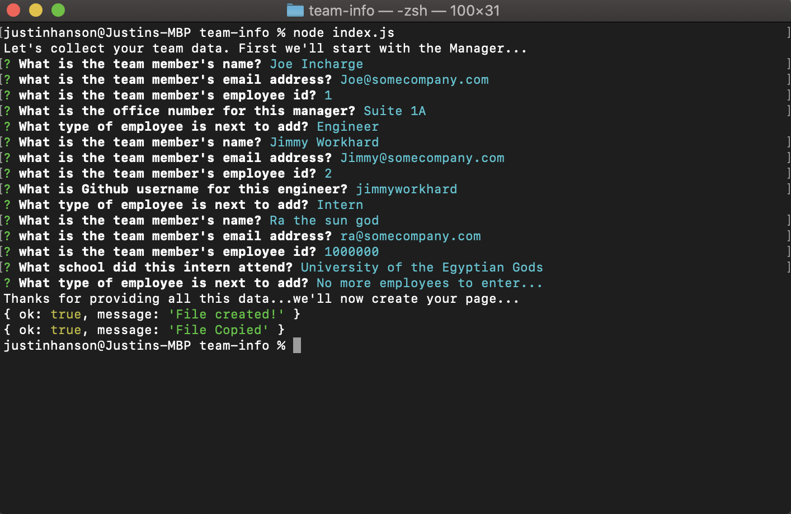
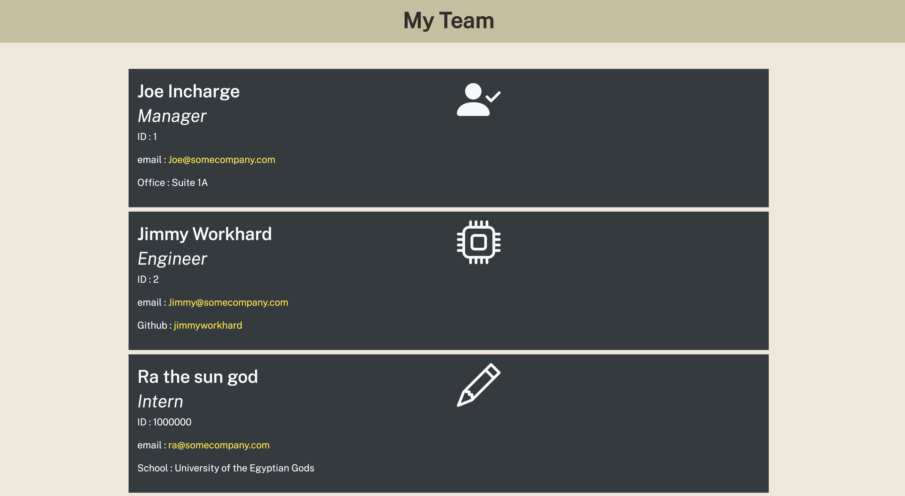

# Team Site Generator  
  No license is applicable for this application

  ## Description:  
  This application solicits information from a user through terminal prompts.  The prompts ask the user about team members and the data is collected, processed, then outputted into and HTML file.  This HTML file, when launched in the browser provides a clean and organized display of team member data.

  
  

  ## Table of Contents:
  * <a name="Installation:">[Installation Instructions](#Installation:)</a>
  * <a name="How-To:">[How to use This Application:](#How-To:)</a>
  * <a name="Contribute:">[How to Contibute:](#Contibute:)</a>
  * <a name="Lixense:">[License Information:](#License:)</a>
  * <a name="Questions:">[Questions:](#Questions:)</a>
  
  
  ## Installation:
  Clone the repository from github to a local directory.
  
  
  ## How-To:  
  Launch the index.js file from the command line when in the correct directory.  Then enter data based on the prompts in the command line.  When finished the application will out put two files: 1-index.html, 2-style.css to the 'dist' subdirectory.  To view the output launch the index.html file with any browser.

  
  ## Contribute:  
  Please reach out to me on github or contact me at hansonjw@gmail.com if you would like to contribute to this project.

  
  ## License:  
  This application is covered under the following license...
  No License  
  For more information on the license click on the badge below:
  No license is applicable for this application
  
  
  ## Questions:  
  For questions, comments, suggestions, I can be reached at the following  
  https://github.com/hansonjw  
  hansonjw@gmail.com
